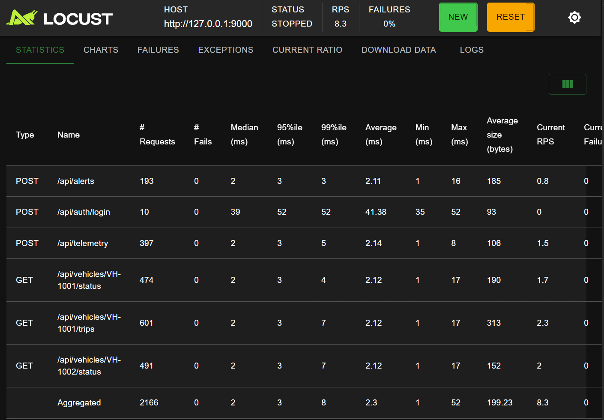

# Vehicle API Testing Platform

这是一个面向车联网业务场景的 API 自动化测试与性能验证项目。

项目会搭建一个模拟车辆数据服务，并围绕用户认证、车辆查询、车辆状态、行驶记录、告警上报、遥测数据上传等接口，逐步实现接口自动化测试、响应结构校验、性能测试和 CI 自动执行流程。

## 项目目标

- 搭建一个具备车联网业务语义的后端 API 服务
- 使用 PyTest 设计接口自动化测试用例
- 使用 JSON Schema 校验接口响应结构
- 使用 Locust 模拟并发接口访问
- 使用 Docker 和 GitHub Actions 完成基础工程化配置

## 技术栈

- Python
- FastAPI
- PyTest
- JSON Schema
- Locust
- Docker
- GitHub Actions

## 计划实现的接口

| 模块 | 接口 | 说明 |
| --- | --- | --- |
| Auth | `POST /api/auth/login` | 用户登录 |
| Vehicles | `GET /api/vehicles` | 查询车辆列表 |
| Vehicles | `GET /api/vehicles/{vehicle_id}/status` | 查询车辆状态 |
| Vehicles | `GET /api/vehicles/{vehicle_id}/trips` | 查询行驶记录 |
| Alerts | `POST /api/alerts` | 上报告警事件 |
| Alerts | `GET /api/alerts` | 查询告警列表 |
| Telemetry | `POST /api/telemetry` | 上传车辆遥测数据 |

## 计划目录结构

```text
vehicle-api-testing-platform/
  app/
    main.py
    models.py
    data_store.py
    auth.py
    routes/
  api_tests/
    clients/
    schemas/
    tests/
    conftest.py
  performance_tests/
    locustfile.py
  docs/
    test-plan.md
  Dockerfile
  docker-compose.yml
  requirements.txt
  README.md


  